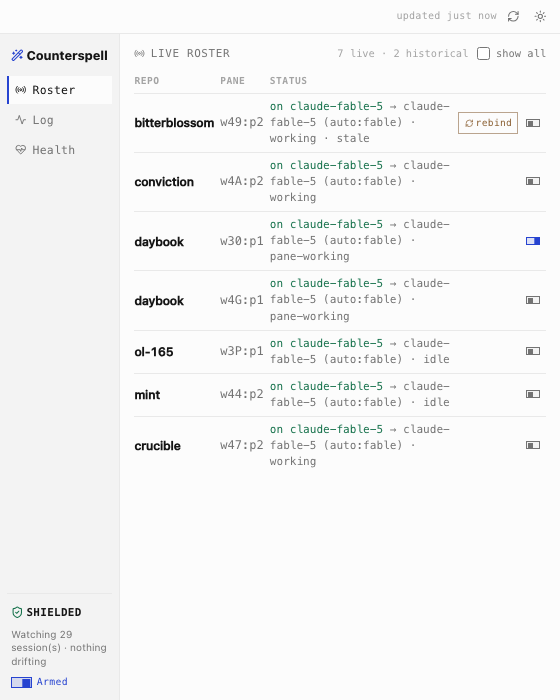
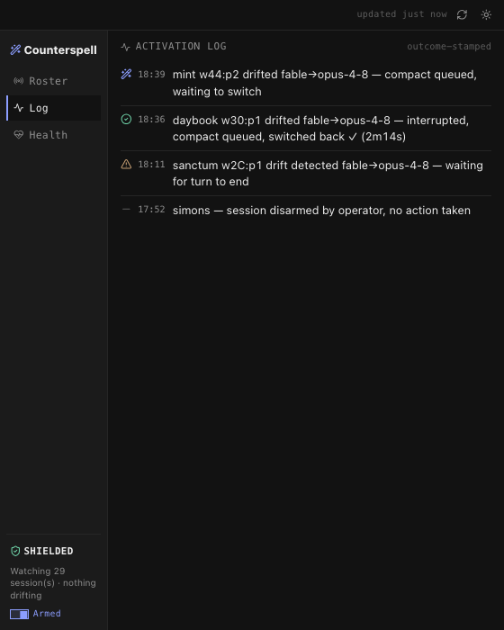
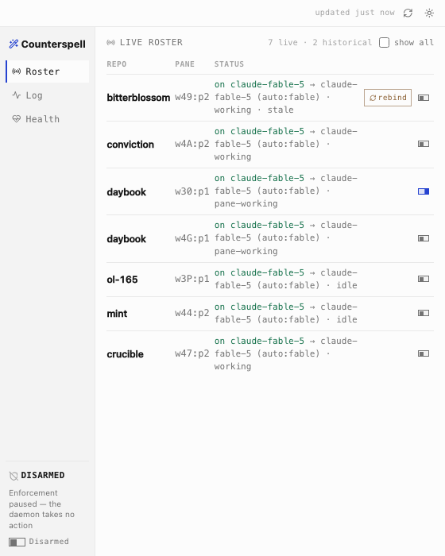

# Counterspell Desktop

A persistent, branded control window for Counterspell — a Tauri v2 app plus a
native tray icon. It answers one question at a glance: **am I protected right
now?**



## What it shows

- **Verdict** — `SHIELDED` / `ACTING` / `DRIFT-BLOCKED (reason)` / `DISARMED`,
  the single answer to "am I protected right now?" Status rides the glyph.
- **Live roster** — watched Claude sessions, live panes first (historical ones
  behind *show all*): repo, pane, model vs target, state, drift, a per-session
  toggle, and a **rebind** button on panes with a broken session binding.
- **Activation log** — outcome-stamped in plain words:
  `w30:p1 switched back to fable ✓ · 3m ago`.
- **Health strip** — daemon scheduled, herdr reachable, last tick age, and a
  loud warning on the one dangerous state (armed but no daemon scheduled).
- **Controls** — global arm/disarm, per-session toggles, rebind.

The tray icon carries a verdict-at-a-glance tooltip and an arm/disarm menu.
Closing the window hides to the tray; quitting the app leaves the headless
enforcement daemon running — protection survives the window closing.

## Design boundary

The app is an **observer + controller only**. It reads the same state the
`watch --arm` daemon reads and writes only the two stable control surfaces
(the global disarm marker, flag-file only, and per-session config targets)
through the `counterspell::api` library surface. It **never** invokes
`launchctl` or loads/unloads daemons — daemon lifecycle is a deliberately
terminal-only concern (`counterspell enable`). See
[`../ARCHITECTURE.md`](../ARCHITECTURE.md) → *Master Switch And Session
Overrides* and *Desktop App*.

## Develop

```sh
# From the repo root (a Cargo workspace):
cargo run -p counterspell-desktop         # launch the window
cargo tauri build --bundles app           # build Counterspell.app (macOS)
cargo test  -p counterspell-desktop       # verdict/log/flag unit + control tests
```

Linux needs the Tauri v2 system deps (`libwebkit2gtk-4.1-dev`,
`libayatana-appindicator3-dev`, `librsvg2-dev`, `libxdo-dev`); CI installs them
and builds the app on macOS and Linux.

## Interim styling

Styling is on vendored `misty-step/aesthetic` tokens (`frontend/tokens.css`);
the full aesthetic skin is a later design-lab pass (counterspell-919). View
components are kept clean so the reskin is a stylesheet swap.

| Activity log (dark) | Disarmed (light) |
| --- | --- |
|  |  |

## Headless UI QA (no desktop contact)

`desktop/frontend/mock-ipc.js` stubs `window.__TAURI__.core.invoke` with fixture
data so the full UI runs in a plain browser. Inject it before `app.js` in a
copy of `index.html`, then drive states via query params:
`?state=disarmed`, `?view=log|health`, `?theme=dark|light`. Screenshot with
headless Chrome (`--window-size=560,700`). Agents must use this (or
`screencapture -l <windowid>`) — never click or focus the live app on the
operator's desktop. Full harness: counterspell-922.
